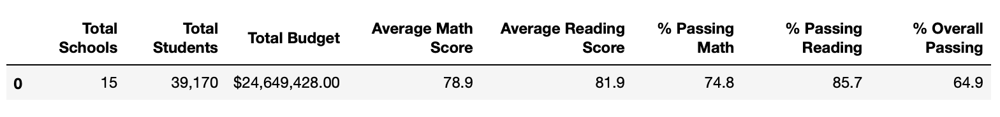

# School_District_Analysis
Using pandas and NumPy for data manipulation and analysis
## Overview of the school district analysis:
---
- Due to the evidence of academic dishonesty, we did not consider the grade 9th scores of Thomas High School
- Find average reading scores of all the schools
- Correlational analysis between the spending and maths and reading scores
- Found the performance of the schools based on their overall passing percentage 
- Summarized the result of our analysis based on school types 

## Results:
---

1)How is the district summary affected?

### *District Summary Analysis:*

- `Average math score` 78.9
- `Average reading score` 81.9
- `Overall passing percentage` 65

 </img>

2)How is the school summary affected?

 ### *School summary analysis:*
Displays detailed analysis of each school:
- School Type 
- Per Student Budget
- Average Math and Reading score of each school
- Percentage passing math
- Percentage passing reading
- Overall Passing

3)How does replacing the ninth graders’ math and reading scores affect Thomas High School’s performance relative to the other schools?
Earlier Thomas High School Overall Passing prcentage was 65.07 but after replaing the overall percentage got increased to 90.63 which made `Thomas High School` in the `Top Five Schools` and in the second position. 

- The percentage passing math increased
- Percentage of passing reading increased
- Percentage of overall passing increased

### *Total number of students were reduced to 1174 from 1635 after ninth grader filtering*
`THS = school_data_complete_df.loc[((school_data_complete_df["grade"] != "9th") & (school_data_complete_df["school_name"] == "Thomas High School"))] number_of_students_THS = THS["Student ID"].count()`

### *Math Passing Percentage*
`math_passing_percentage_THS =(passing_students_math_THS/number_of_students_THS) * 100
math_passing_percentage_THS`

### *Reading Passing Percentage*
`reading_passing_percentage_THS = (passing_students_reading_THS/number_of_students_THS)*100
reading_passing_percentage_THS`

### *Passing Students Overall Percentage*
`passing_students_overall_percentage_THS = (passing_students_overall_THS/number_of_students_THS)*100
passing_students_overall_percentage_THS`

4)How does replacing the ninth-grade scores affect the following:

a) Math and reading scores by grade

### *Math Scores by Grade*

`math_scores_by_grade = pd.DataFrame({
"9th": ninth_grade_math_scores,
"10th": tenth_grade_math_scores,
"11th": eleventh_grade_math_scores,
"12th": twelfth_grade_math_scores})
math_scores_by_grade.head()`

### *Reading Scores by Grade*

`reading_scores_by_grade = pd.DataFrame({
"9th": ninth_grade_reading_scores,
"10th": tenth_grade_reading_scores,
"11th": eleventh_grade_reading_scores,
"12th": twelfth_grade_reading_scores})
reading_scores_by_grade.head()`

b) Scores by school spending

### *Establishing spending bins and group names*

`spending_bins = [0, 585, 630, 645, 675]
group_names = ["<$584", "$585-629", "$630-644", "$645-675"]`
### *Categorize spending based on the bins*
`per_school_summary_df["Spending Ranges (Per Student)"] = pd.cut(per_school_capita, spending_bins, labels=group_names)
per_school_summary_df`

c) Scores by school size
### *Establish the bins*
`size_bins = [0, 1000, 2000, 5000]
group_names = ["Small (<1000)", "Medium (1000-2000)", "Large (2000-5000)"]`

### *Categorize spending based on the bins*
`per_school_summary_df["School Size"] = pd.cut(per_school_summary_df["Total Students"], size_bins, labels=group_names)
per_school_summary_df.head()`

d) Scores by school type
#### Math Scores:
`type_math_scores = per_school_summary_df.groupby(["School Type"]).mean()["Average Math Score"]`
#### Reading Scores:
`type_reading_scores = per_school_summary_df.groupby(["School Type"]).mean()["Average Reading Score"]`
#### Passing Math:
`type_passing_math = per_school_summary_df.groupby(["School Type"]).mean()["% Passing Math"]`
#### Passing Reading:
`type_passing_reading = per_school_summary_df.groupby(["School Type"]).mean()["% Passing Reading"]`
#### Overall Passing
`type_overall_passing = per_school_summary_df.groupby(["School Type"]).mean()["% Overall Passing"]`

## Summary: 
Summarize four major changes in the updated school district analysis after reading and math scores for the ninth grade at Thomas High School have been replaced with NaNs.

- Data was counting the values which were replaced by NaNs, after eliminating the ninth grade scores and headcount
    - we saw the significant jump in overall passing percentage
    - math and reading percentage 
- Total student count was lowered 
- Math percentage, Reading percentage were increased
- Overall passing percentage were increased 
